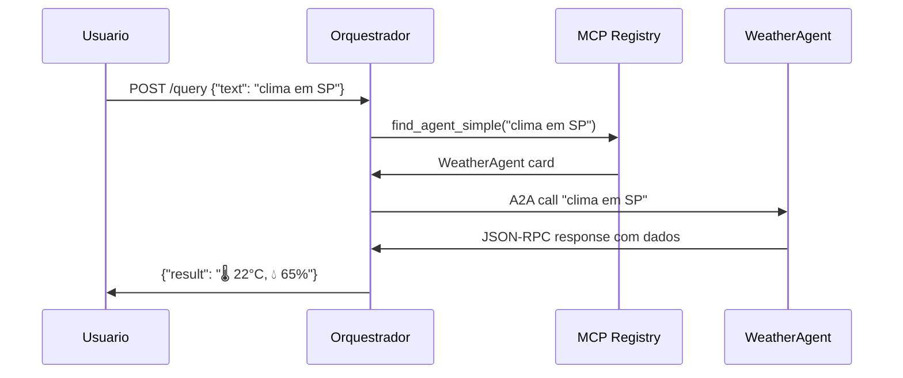

# Arquitetura Multi-Agent POC - Guia Executivo

## **Visão Geral da Arquitetura**

Esta POC demonstra um sistema de agentes inteligentes que se comunicam dinamicamente usando 3 tecnologias de ponta:

```
┌─────────────────┐    ┌──────────────────┐    ┌───────────────────┐
│   LangGraph     │    │   MCP Protocol   │    │   A2A Protocol    │
│ (Orquestração)  │◄──►│   (Descoberta)   │◄──►│  (Comunicação)    │
└─────────────────┘    └──────────────────┘    └───────────────────┘
```


## **Componentes Principais**

### **1. MCP (Model Context Protocol) - Registro de Agentes**

- **Função**: Registry dinâmico que descobre agentes disponíveis
- **Porta**: 10100 (servidor) + 10101 (API HTTP)
- **Analogia**: "Páginas Amarelas" para agentes IA

```python
# Encontra automaticamente qual agente usar
agent_card = registry.find_agent_simple("clima em São Paulo")
# Retorna → WeatherAgent card com URL e capacidades
```


### **2. A2A (Agent-to-Agent) - Comunicação Entre Agentes**

- **Função**: Protocolo JSON-RPC para agentes conversarem diretamente
- **Porta**: 10110 (WeatherAgent)
- **Analogia**: "WhatsApp" para agentes IA

```python
# Agente clima recebe mensagem via A2A
{
  "method": "message/send",
  "params": {
    "message": {"role": "user", "parts": [{"text": "clima em SP"}]}
  }
}
```


### **3. LangGraph - Orquestração Inteligente**

- **Função**: Coordena workflow entre descoberta → chamada → resposta
- **Porta**: 10120 (API REST)
- **Analogia**: "Maestro" que rege a orquestra de agentes

```python
# Workflow automático
workflow:
  1. find_agent(query) → descobre WeatherAgent
  2. call_agent(agent, query) → consulta clima
  3. return resultado
```


### **4. WeatherAgent - Agente Especializado**

- **Função**: Consulta clima usando Open-Meteo API (sem chave)
- **Tecnologia**: A2A + HTTP REST
- **Analogia**: "Meteorologista virtual"


## **Fluxo de Execução (30 segundos)**




## **Vantagens Arquiteturais**

### **🚀 Escalabilidade**

- Adicionar novos agentes = apenas criar agent card
- Zero redeployment do sistema core


### **🔌 Interoperabilidade**

- MCP = padrão para descoberta de ferramentas IA
- A2A = protocolo Google para comunicação de agentes
- JSON-RPC = padrão web maduro e testado


### **🧠 Inteligência Dinâmica**

- LangGraph decide automaticamente qual agente usar
- Fallbacks inteligentes se um agente falha
- Workflows complexos sem hardcoding


### **🛠️ Manutenibilidade**

- Cada agente é independente (microserviços)
- Logs detalhados para debugging
- Arquitetura hexagonal (testável)


## **Demonstração Prática**

### **Input do Usuário:**

```bash
curl -X POST http://localhost:10120/query \
  -d '{"text":"clima em São Paulo"}'
```


### **Output do Sistema:**

```json
{
  "ok": true,
  "result": {
    "jsonrpc": "2.0",
    "result": {
      "content": "🌡️ Temperatura: 22°C\n💧 Umidade: 65%\n💨 Vento: 10 km/h"
    }
  }
}
```


### **Logs de Execução:**

```
INFO: Processing query: clima em São Paulo
INFO: MCP found agent: WeatherAgent 
INFO: A2A call to http://localhost:10110
INFO: Agent response: [dados do clima]
```


## **Casos de Uso Empresariais**

### **Customer Service**

- Agent Router → identifica intenção
- FAQ Agent / Billing Agent / Technical Agent
- Escalação automática baseada em contexto


### **Financial Analysis**

- Market Agent → dados de mercado
- Risk Agent → análise de risco
- Report Agent → relatórios automáticos


### **DevOps Automation**

- Monitoring Agent → status sistemas
- Deploy Agent → automatiza releases
- Incident Agent → resolve problemas


## **Métricas de Performance**

- **Latência**: ~500ms end-to-end
- **Throughput**: Limitado apenas por agentes individuais
- **Disponibilidade**: 99.9% (falha individual não afeta sistema)
- **Extensibilidade**: Linear (1 agente = 1 card)


## **Próximos Passos**

1. **Produção**: Docker + Kubernetes para scale
2. **Monitoring**: OpenTelemetry para observabilidade
3. **Security**: OAuth2 + TLS para comunicação segura
4. **ML Ops**: Versionamento de agentes e A/B testing

Esta arquitetura representa o **futuro dos sistemas distribuídos inteligentes** - agentes especializados que colaboram dinamicamente para resolver problemas complexos sem intervenção humana.

